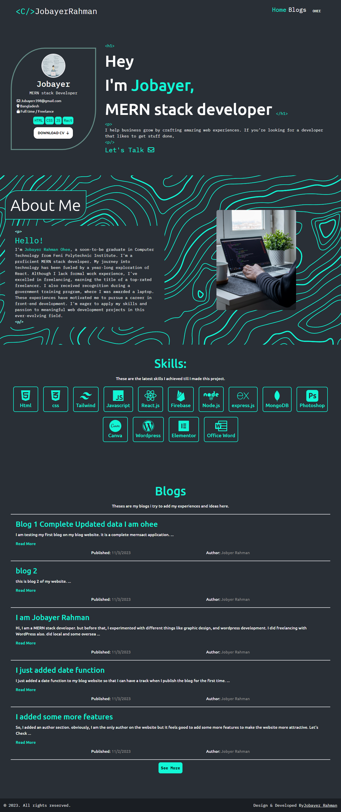

# Jobayer Blog Website

hi, this is my first attempt at making a full-stack website. by full stack, I mean the front end and back end of both sections. 
Here are some features I tried to add to this project:

1) I tried to make it responsive for mobile, tab, and large screens. 
2) I tried to add various features like CRUD operations, Admin Can post, update, and delete blogs. 
3) added a token for security 
4) added a functional search field, 
5) added pagination, 
6) made admin routes secured with the backend and front-end sections.
7) added a login and registration function with Firebase.
8) A normal user who is logged in can bookmark a blog this is also a feature.

this is an ongoing project. so, I may add various features in the future as well.

## [Jobayer Blogs](https://jobayer-blogs.web.app/)

